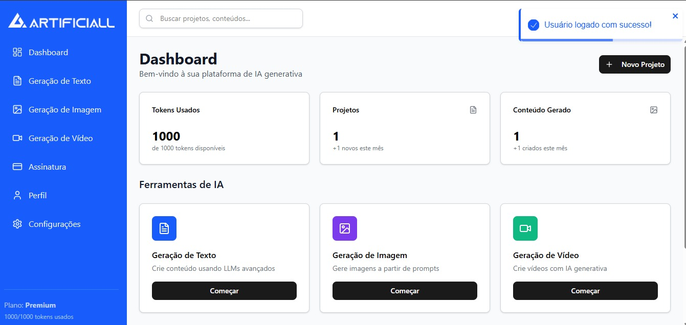
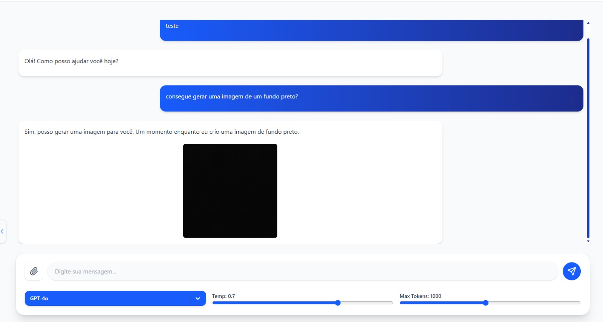
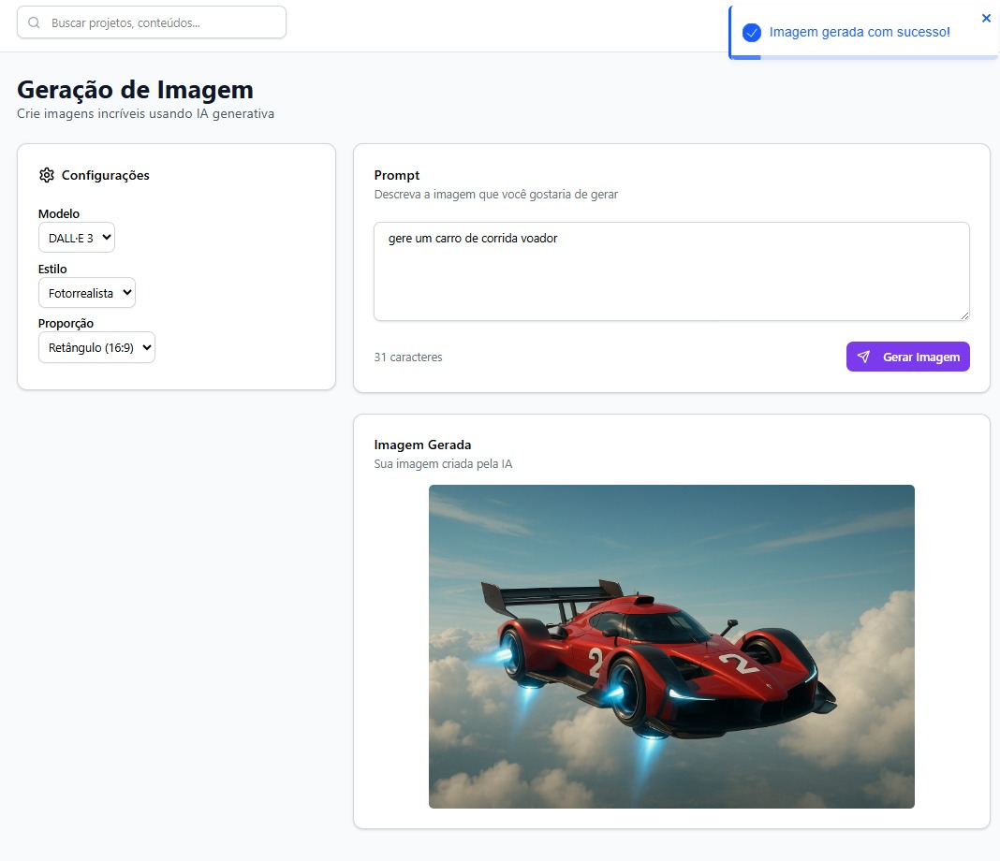

# Plataforma SaaS com Integração de Inteligência Artificial

Plataforma SaaS desenvolvida durante estágio na Artificiall, concebida com foco em arquitetura escalável, organização modular e evolução contínua de produto digital.

O projeto foi estruturado para centralizar múltiplos serviços de geração de conteúdo em uma única plataforma, permitindo ao usuário interagir com diferentes provedores de Inteligência Artificial por meio de uma interface unificada, com controle de acesso, histórico persistente e organização de recursos por perfil de utilização.

A aplicação contempla fluxos completos de autenticação, gerenciamento de planos, administração de usuários, armazenamento de histórico de conversas e suporte à geração de conteúdo multimodal, incluindo diferentes tipos de entrada e saída conforme o modelo integrado.

Além da camada funcional, o desenvolvimento priorizou separação clara entre frontend e backend, componentização, reaproveitamento de código e manutenção de uma base preparada para evolução incremental de novas funcionalidades.

## Preview da Aplicação

### Dashboard



### Chat com Inteligência Artificial



### Geração de Imagens



### Geração de Vídeos


## Principais Funcionalidades

- Autenticação e gerenciamento de usuários  
- Controle de sessões e permissões de acesso  
- Geração de conteúdo com múltiplos provedores de IA  
- Histórico persistente de conversas e conteúdos gerados  
- Painel administrativo para gerenciamento interno  
- Controle de planos e regras de utilização  
- Upload e gerenciamento de arquivos  
- Fluxos de geração multimodal  
- Organização modular para expansão de novos serviços  

## Arquitetura do Projeto

O projeto está organizado em duas aplicações principais, separando responsabilidades entre interface e serviços de backend.

### Frontend

<p>
  
</p>

- React  
- Vite  
- Tailwind CSS  

A camada frontend foi construída com foco em componentização, reutilização de interface, gerenciamento de estados e experiência responsiva, suportando fluxos de autenticação, dashboard administrativo, histórico de geração e gerenciamento de configurações do usuário.

### Backend

<p>
  
</p>

- Flask  
- Python  

O backend foi estruturado em APIs REST responsáveis por autenticação, controle de regras de negócio, integração com provedores externos, gerenciamento de histórico, persistência de dados e segurança de acesso.

### Banco de Dados

<p>
  
</p>

- PostgreSQL  

Utilizado para persistência estruturada de usuários, planos, históricos, permissões e demais entidades centrais da aplicação.

### Infraestrutura

<p>
  
</p>

- Docker  
- Nginx  
- Hospedagem frontend em Hostinger  
- Backend executado em máquina virtual Windows Server  

A infraestrutura foi organizada com separação entre frontend e backend, utilizando Nginx como camada de comunicação entre serviços, containerização com Docker e banco de dados persistido em ambiente dedicado, permitindo integração entre os componentes da aplicação de forma controlada e escalável.

## Integrações

- OpenAI API  
- Gemini API  
- Claude API  
- Perplexity API  
- OpenRouter API  

As integrações permitem utilização de múltiplos modelos de linguagem dentro da mesma arquitetura, facilitando testes, comparação de respostas e ampliação de recursos conforme necessidade do produto.

## Estrutura do Projeto

```bash
ai_saas/
├── ai_saas_frontend/
├── ai_saas_backend/
```

## Observações

Projeto desenvolvido com foco em separação de responsabilidades, organização modular, escalabilidade e integração de múltiplos serviços modernos para aplicações SaaS.